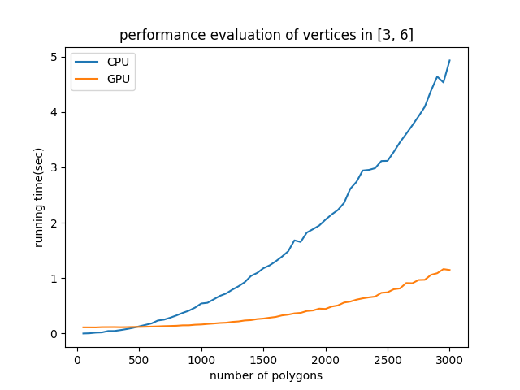
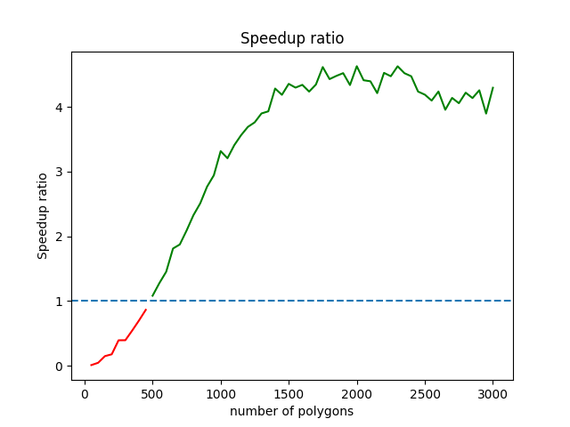
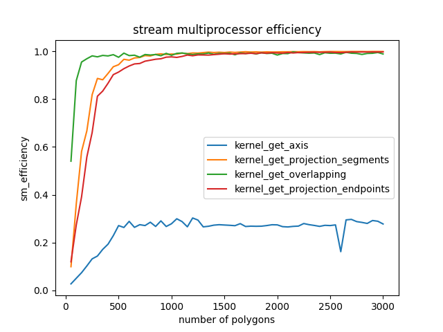

# SAT GPU implemention demo

An SAT(Seperating Axis Theorem) implementation on CPU and GPU.

Directories:

- archive

    Archived files not using in the main project, just as a reference.

- doc

    Documents for the project.

- polygon_io

    Python scripts to generate/view input/output data of the SAT algorithm.

- sat

    SAT algorithm implemention.

## Usage

Before running the program, you need to build up environment first:

- python

   Need python>=3.8, pipenv

   ```bash
   cd polygon_io
   pipenv install
   ```

- cuda

This project was evaluated on a machine with Intel Xeon Processor (Skylake, IBRS) and Tesla V100.

### Polygon generator

Location: polygon_io/generator.py

Description: Randomly generate polygons as the input of SAT.
   
```bash
$ pipenv run python generator.py --help
Usage: generator.py [OPTIONS]

  e.g. python generator.py --count 5 --point 30 --vmin 3 --vmax 6 --output
  polygon_input.txt

Options:
  --count INTEGER  Number of polygons.
  --point INTEGER  Number of sample points.
  --vmin INTEGER   Minimal number of vertices.
  --vmax INTEGER   Maximal number of vertices.
  --output TEXT    Output text file.
  --help           Show this message and exit.
```

e.g. Use xargs to generate a group of data file in parallel:

```bash
seq 50 50 3000 | xargs -t -P 8 -I{} pipenv run python generator.py --count {} --point 30000 --vmin 3 --vmax 6 --output './dataset/polygon_input_c'{}'_v6.txt'
```

where `-P 8` indicates using 8 parallel processes.

### Polygon viewer

#### Input viewer

Location: polygon_io/input_viewer.py

Description: Show a SAT input data in graph.

```bash
$ pipenv run python input_viewer.py --help
Usage: input_viewer.py [OPTIONS]

Options:
  --input TEXT   Input text file.
  --output TEXT  Output png file.
  --help         Show this message and exit.
```

e.g. Show a test case as demo.

```bash
pipenv run python input_viewer.py --input ../sat/testcases/test2_overlap.txt --output viewer_temp.png
```

#### Output viewer

Location: polygon_io/output_viewer.py

Description: Show a SAT output data in graph.
   
```bash
$ pipenv run python output_viewer.py --help
Usage: output_viewer.py [OPTIONS]

Options:
  --input TEXT   Input text file.
  --output TEXT  Output png file.
  --help         Show this message and exit.
```

e.g. Show a test case as demo.

```bash
pipenv run python output_viewer.py --input ../sat/testcases/test2_overlap_res.txt --output viewer_temp.png
```

### SAT

Location: sat/sat.out

Description: SAT algorithm implementation.

1. Before evaluating, you can run test first to check your environment.

    ```bash
    bash test.sh
    ```

2. Compile and run

    ```bash
    make clean; make
    ```

    after that you can get the `sat.out`

    ```bash
    $ ./sat.out
    invalid argument.
    usage: sat.out -i input_file [-o output_file] [-g]
    -i: input_file. Input polygon text file generated by generator.py
    -o: output_file. Optional. Default as stdout. Output polygon and SAT text file. Show graphic result by viewer.py
    -g: use gpu. Optional. A flag to set if running sat on GPU.
    e.g. sat.out -i polygon_input.txt
         sat.out -i polygon_input.txt -o polygon_output.txt
         sat.out -i polygon_input.txt -o polygon_output.txt -g
    ```

    e.g. Evaluate using dataset generated above. (see *Use xargs to generate a group of data file in parallel*)

    - Evaluate on CPU

        ```bash
        ls ../dataset | sort -n -t c -k 2 | xargs -t -L 1 -I{} ./sat.out -i ../dataset/{} -o polygon_output.txt
        ```

    - Evaluate on GPU

        ```bash
        ls ../dataset | sort -n -t c -k 2 | xargs -t -L 1 -I{} ./sat.out -i ../dataset/{} -o polygon_output_gpu.txt -g
        ```

3. Performance analyse

    sat.out prints calculation time to stdout, you can do performance analysis based on that data. Scripts in sat/evaluation are some demos doing that. Check it out.(needs matplotlib)

    <center>
    <figure>
        
        
        
    </figure>
    </center>